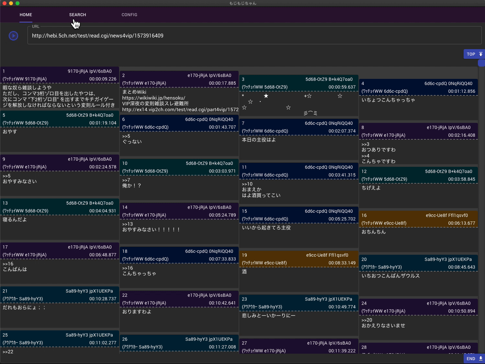

# もじもじちゃん

[](https://opensource.org/licenses/MIT)


<a href="https://github.com/vipzero/mojimoji-chan/releases/latest">
	
</a>


## development

```bash
yarn run start
```

* Electron
* Typescript
* React


## License

MIT [vipzero](hello.vipper.dev)
